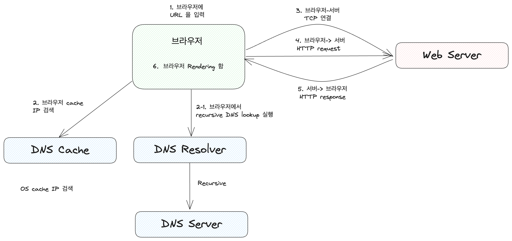

# 웹 통신의 큰 흐름: https://www.google.com/ 을 접속할 때 일어나는 일

1. 브라우저에 사용자가 DNS 입력합니다.  
2. 브라우저 캐시 : DNS 에 연결된 IP 주소를 조회합니다.
- 브라우저 캐시에 존재하지 않을 경우, OS 캐시에서 검색합니다. 
2-1. 브라우저가 직접 DNS 재귀적으로 서버의 IP 주소를 검색합니다. 
- DNS Resolver 관련 자료 추가 예정
3. 서버의 IP 를 찾으면, 브라우저-서버 간 TCP 연결을 합니다.
4. 브라우저는 서버로 HTTP Request 를 전송합니다. 
5. 서버는 브라우저로 HTTP Response 를 전송합니다. 
6. 브라우저는 HTTP Response 를 렌더링 합니다. 